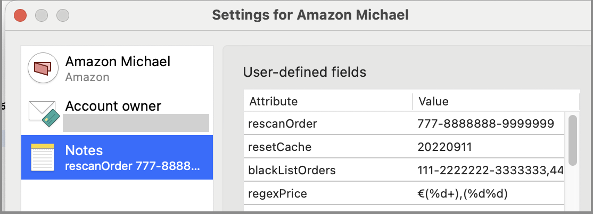

# Amazon Plugin for MoneyMoney
## Installation
You can get the signed version from https://moneymoney-app.com/extensions/amazon-orders.lua. The unsigned [beta](https://raw.githubusercontent.com/Michael-Beutling/Amazon-MoneyMoney/beta/amazon-orders.lua) and [latest](https://raw.githubusercontent.com/Michael-Beutling/Amazon-MoneyMoney/master/amazon-orders.lua) versions are available from this repository.

To activate the extension, copy the file into `~/Library/Containers/com.moneymoney-app.retail/Data/Library/Application\ Support/MoneyMoney/Extensions`. If you have cloned this repository you can use the `link_ext.sh` script in a shell. A restart is not required, it will load automatically. You can verify installation using *Window → Log*.

**Look out:** MoneyMoney only runs unsigned plugins in the **beta version** and you need to **disable signature check** in the extentsion settings.

## Usage
After installation go to *Add new account* → *Others* → *Amazon Orders*. There are a few different account types:
* **Normal**: List your spendings like a normal bank account: Purchases are negative, refunds and bonuses are positive.
* **Inverted**: Like a normal account, but inverted: Purchases are positive, refunds and bonuses are negative.
* **Mix**: Shows both a positive and a negative booking for each purchase. The account total is always zero.
* **Monthly**: Negative bookings for each purchase. A monthly positive counter booking to zero out the account.
* **Yearly**: Negative bookings for each purchase. A yearly postitive counter booking to zero out the account.

## Config
Some hard coded parameters can be overwritten in the MoneyMoney account settings:

## Performance
The script caches some data, but the first time it scrapes your whole order history. In facts ~10 years of shopping with about 230 orders with 340 positions takes 12 minutes in the first run! The second run needs 2 minutes. After that all data is cached so a normal run needs 20-30 seconds.

## Reset cache to enforce full order history reload
In MoneyMoney right-click the account, select settings, then notes. Add the attribute resetCache with any value, e.g. today's date.
Going forward, whenever the attribute value gets changed, the cache is cleared and the whole account is reread.

## Blacklist invalid orders
Orders that cause erros can be omitted via the blackListOrders attribute in the settings. Simply enter the order numbers separated by commas as a value. See screen shot above.

## Warranty
Nope, no warranty! When the script orders 10 tons of dog food every day, it's your problem!
